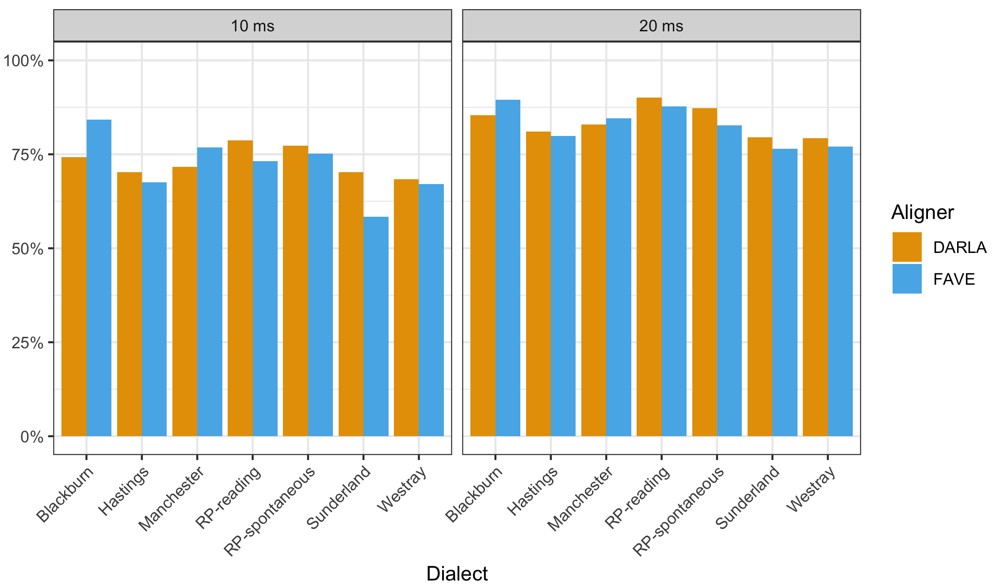

```{r setup, include=FALSE}
knitr::opts_chunk$set(echo = TRUE)
```



## Publications

Turton, Danielle and Maciej Baranowski.  Submitted. The FOOT-STRUT vowels in Manchester.

Baranowski, Maciej and Danielle Turton. Submitted. TD-deletion in British English: New evidence for the long lost morphological effect.  Accepted pending revisions at *Language Variation and Change*.

MacKenzie, Laurel and Danielle Turton.  In prep.  Assessing the accuracy of existing forced alignment software on varieties of British English.

#### 2018
Baranowski, Maciej and Danielle Turton. 2018. [The FOOT-STRUT vowels in Manchester. Evidence for the diachronic precursor to the split?](https://repository.upenn.edu/cgi/viewcontent.cgi?article=2017&context=pwpl) *Penn Working Papers in Linguistics*, 24(2).

Schleef, Erik and Danielle Turton. 2018. [Sociophonetic variation of like in British dialects: effects of function, context and predictability](https://www.cambridge.org/core/journals/english-language-and-linguistics/article/sociophonetic-variation-of-like-in-british-dialects-effects-of-function-context-and-predictability-1/0EFFDF327F80E05BA7B79279627C8740). *English Language and Linguistics*, 22(1), 35-75.

#### 2017
Turton, Danielle. 2017. [Categorical or gradient? An ultrasound investigation of /l/-darkening and vocalisation in varieties of English](http://labphon.ubiquitypress.com/articles/10.5334/labphon.35/). In *Journal of the Association for Laboratory Phonology*, 8(1).

#### 2016
Turton, Danielle. 2016. [Synchronic stratum-specific rates of application reflect diachronic change: morphosyntactic conditioning of variation in English /l/-darkening](http://journals.ed.ac.uk/pihph/article/view/1697). *Papers in Historical Phonology*, Volume 1. 

#### 2015
Baranowski, Maciej and Danielle Turton. 2015. [Manchester English](https://www.staff.ncl.ac.uk/danielle.turton/docs/Baranowski_Turton_2015_Manchester_authors_manuscript.pdf). In Raymond Hickey (ed.) Researching Northern Englishes. Amsterdam and Philadelphia: John Benjamins.

Turton, Danielle. 2015. [Determining categoricity in English /l/-darkening: A Principal Component Analysis of ultrasound spline data](https://www.staff.ncl.ac.uk/danielle.turton/docs/ICPhS.pdf). Proceedings of the International Congress of Phonetic Science (ICPhS) , Glasgow, 10th-14th August 2015.

#### 2014
Turton Danielle. 2014. [Some /l/s are darker than others: Accounting for variation in English /l/ with ultrasound tongue imaging](https://repository.upenn.edu/cgi/viewcontent.cgi?article=1826&context=pwpl). *Penn Working Papers in Linguistics* 2014, 20(2).

Turton, Danielle. 2013. [The darkening of English /l/: A Stochastic Stratal OT analysis](http://ling.auf.net/lingBuzz/001524). Research paper, the University of Manchester.\


## Conference Presentations
...

