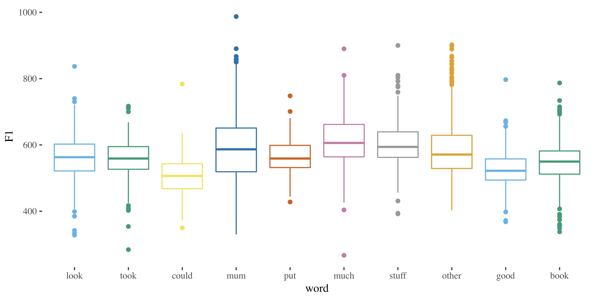

```{r setup, include=FALSE}
knitr::opts_chunk$set(echo = TRUE)
```



Course website for SEL3094/8513 Accents of English/Variation and the Grammar:
(https://danielleturton.github.io/accentsofenglish/)


## PhD Supervision
I am interested in supervising PhD topics in phonological variation and change, laboratory phonology, quantitative methods in variation, accents of English, language change (particularly the synchrony and diachrony of phonological processes) and ultrasound tongue imaging.

### Current students
[Jasmine Warburton](https://www.ninedtp.ac.uk/jasmine-warburton-tyneside-vowel-mergers-speech-production-perception/): Tyneside vowel mergers in production and perception

Chanuwan Phetkla: Thai loanword phonology

Suaad Ambu-Saidi: Variation and change in the Nizwa Dialect of Omani Arabic

[Caitlin Halfacre](https://caitlinhalfacre.wordpress.com/): Variation and change in Received Pronunciation

[Jac Mantle](https://www.ninedtp.ac.uk/jac-mantle-pre-speech-tongue-movements-verbal-reaction-times-acquired-apraxia-speech/): Using ultrasound Tongue Imaging and reaction time methods to investigate initiation and planning in Apraxia of Speech

### Past students
Chutinan Noobutra (2018): Interaction between Markedness and Transfer of /l/ and /r/ in Thai Learners English.

## Classes
SEL3094 Accents of English, SEL8513 Variation and the Grammar, HSS8005 Quantitative Methods in Linguistics, SEL1032 Dealing with Data (2018-19, Semester 2).

